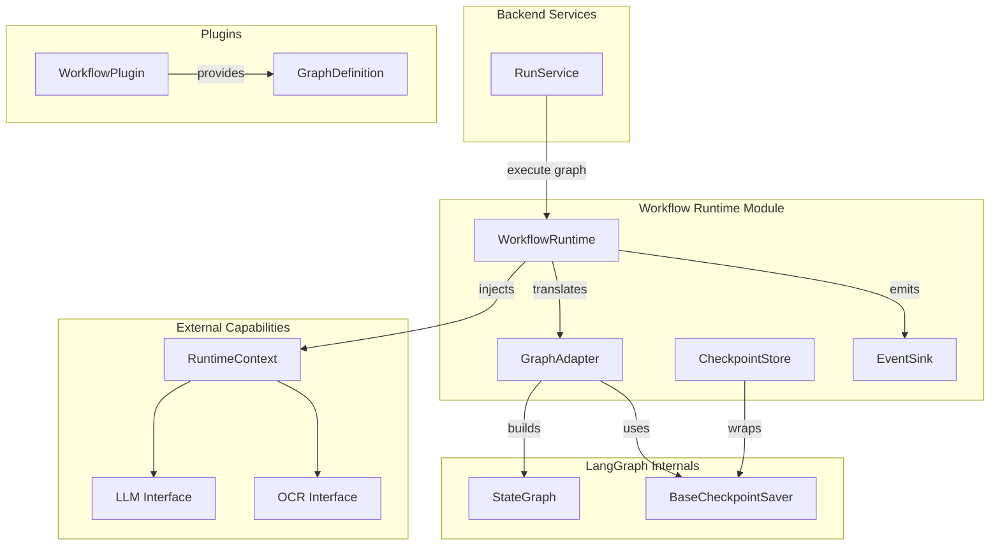
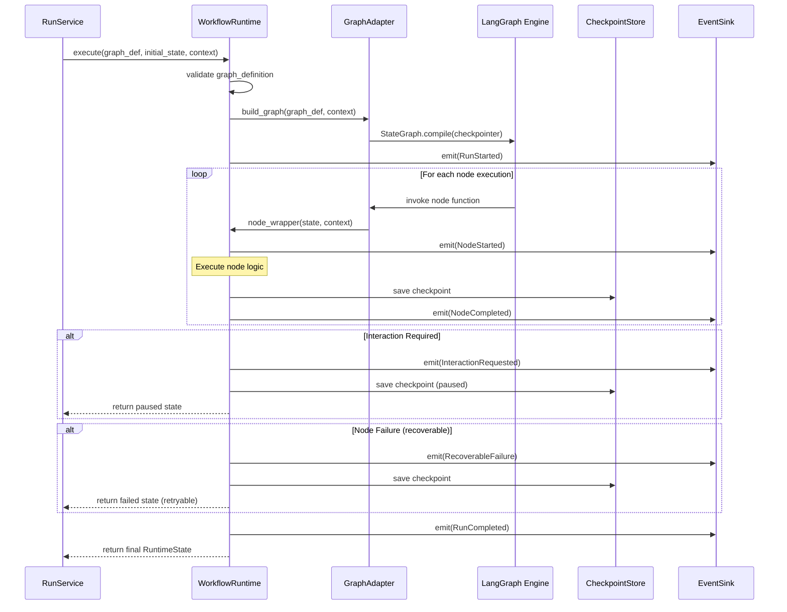

# Design Document: LangGraph Integration

## Overview

This design introduces a project-owned workflow runtime abstraction backed by LangGraph that enables workflow plugins to define their processing as composable directed graphs. The runtime mediates between backend services and LangGraph, keeping all LangGraph-specific types internal to a single module while exposing only project-owned Pydantic models to the rest of the system.

The key architectural decision is a **thin adapter layer** pattern: the project defines its own `GraphDefinition`, `RuntimeState`, `RuntimeEvent`, and `RuntimeContext` types. A single internal adapter module translates these into LangGraph's `StateGraph`, compiles the graph with a checkpointer, and executes it. This keeps the LangGraph dependency contained and replaceable.

The runtime supports:
- Graph-based execution with named nodes, transitions, and conditional routing
- Checkpointed durable execution with pause/resume/retry
- Human-in-the-loop interruptions via structured interaction requests
- Normalized event emission decoupled from LangGraph internals
- Injectable external capabilities for testability
- Backward compatibility with existing synchronous plugins

### Design Rationale

1. **Adapter over inheritance**: Rather than subclassing LangGraph types, we wrap them. This prevents LangGraph version changes from propagating through the codebase.
2. **State as Pydantic model**: Runtime state is a single Pydantic v2 model with explicit schema versioning, enabling serialization round-trips and migration.
3. **Event sink abstraction**: Events flow through an injectable sink rather than LangGraph's native streaming, enabling test observation and future SSE/WebSocket delivery.
4. **Checkpoint store abstraction**: A project-owned checkpoint store interface wraps LangGraph's `BaseCheckpointSaver`, allowing in-memory fakes for tests and future persistent backends.

## Architecture



### Module Placement

| Component | Location | Depends On |
|-----------|----------|------------|
| `RuntimeState`, `RuntimeEvent`, `InteractionRequest`, `GraphDefinition` | `domain/runtime.py` | `domain/models.py` |
| `WorkflowRuntime` | `backend/services/workflow_runtime.py` | domain, plugins |
| `GraphAdapter` | `backend/services/graph_adapter.py` | LangGraph (internal only) |
| `CheckpointStore` (protocol) | `domain/runtime.py` | — |
| `InMemoryCheckpointStore` | `backend/storage/checkpoint_store.py` | domain |
| `EventSink` (protocol) | `domain/runtime.py` | — |
| `InMemoryEventSink` | `backend/storage/event_sink.py` | domain |
| `RuntimeContext` | `domain/runtime.py` | — |
| Graph-capable plugin base | `plugins/base.py` (extended) | domain |

### Execution Flow



## Components and Interfaces

### WorkflowRuntime

The central orchestrator that accepts a graph definition and drives execution.

```python
from typing import Protocol

class WorkflowRuntime:
    """Project-owned runtime abstraction wrapping LangGraph."""

    def __init__(
        self,
        *,
        checkpoint_store: CheckpointStore,
        event_sink: EventSink,
    ) -> None: ...

    def execute(
        self,
        *,
        graph_definition: GraphDefinition,
        initial_state: RuntimeState,
        context: RuntimeContext,
        run_id: str,
    ) -> RuntimeState:
        """Execute a graph from initial state to completion or interruption."""
        ...

    def resume(
        self,
        *,
        run_id: str,
        user_response: InteractionResponse,
        context: RuntimeContext,
    ) -> RuntimeState:
        """Resume a paused execution with user-provided response."""
        ...

    def retry(
        self,
        *,
        run_id: str,
        context: RuntimeContext,
    ) -> RuntimeState:
        """Retry from the last successful checkpoint."""
        ...

    def validate_graph(self, graph_definition: GraphDefinition) -> list[str]:
        """Validate graph structure. Returns list of errors (empty = valid)."""
        ...
```

### GraphDefinition

Plugin-provided declaration of the workflow graph structure.

```python
from pydantic import BaseModel, Field
from typing import Callable

class GraphNode(BaseModel):
    """A named operation in the workflow graph."""
    node_id: str
    description: str
    interrupt_before: bool = False  # Pause for user input before execution

class GraphEdge(BaseModel):
    """A transition between nodes."""
    source: str
    target: str

class ConditionalRoute(BaseModel):
    """A conditional transition based on runtime state."""
    source: str
    routing_function_id: str  # References a registered routing function
    targets: dict[str, str]  # routing_key -> target_node_id

class GraphDefinition(BaseModel):
    """Complete graph structure provided by a workflow plugin."""
    nodes: list[GraphNode]
    edges: list[GraphEdge]
    conditional_routes: list[ConditionalRoute] = Field(default_factory=list)
    entry_node: str
    terminal_nodes: list[str]
```

### CheckpointStore Protocol

```python
from typing import Protocol

class CheckpointStore(Protocol):
    """Persistence interface for workflow checkpoints."""

    def save(self, run_id: str, checkpoint: Checkpoint) -> None: ...
    def get(self, run_id: str) -> Checkpoint | None: ...
    def delete(self, run_id: str) -> None: ...
```

### EventSink Protocol

```python
from typing import Protocol

class EventSink(Protocol):
    """Destination for runtime events. Must not block graph execution."""

    def emit(self, event: RuntimeEvent) -> None: ...
```

### RuntimeContext

```python
from typing import Protocol, Any

class LLMCapability(Protocol):
    """Interface for LLM model calls."""
    def generate(self, prompt: str, **kwargs: Any) -> str: ...

class OCRCapability(Protocol):
    """Interface for OCR extraction."""
    def extract_text(self, image_data: bytes) -> str: ...

class EmbeddingCapability(Protocol):
    """Interface for embedding generation."""
    def embed(self, text: str) -> list[float]: ...

class RuntimeContext(BaseModel, arbitrary_types_allowed=True):
    """Injectable container of external capabilities for graph nodes."""
    llm: LLMCapability | None = None
    ocr: OCRCapability | None = None
    embedding: EmbeddingCapability | None = None

    def get_capability(self, name: str) -> Any:
        """Get a capability by name, raising ConfigurationError if missing."""
        capability = getattr(self, name, None)
        if capability is None:
            raise ConfigurationError(
                f"Required capability '{name}' not registered in RuntimeContext"
            )
        return capability
```

### Graph-Capable Plugin Extension

```python
# Extended plugins/base.py

class GraphCapableWorkflowPlugin(WorkflowPlugin[WorkflowPluginConfigT]):
    """Extended plugin interface for graph-based workflows."""

    @property
    def graph_definition(self) -> GraphDefinition | None:
        """Return graph definition if this plugin is graph-capable."""
        return None

    def get_node_function(
        self, node_id: str
    ) -> Callable[[RuntimeState, RuntimeContext], RuntimeState]:
        """Return the execution function for a named node."""
        raise NotImplementedError(f"No function registered for node '{node_id}'")

    def get_routing_function(
        self, routing_function_id: str
    ) -> Callable[[RuntimeState], str]:
        """Return a routing function for conditional edges."""
        raise NotImplementedError(
            f"No routing function registered for '{routing_function_id}'"
        )
```

### GraphAdapter (Internal)

This module is the only place that imports LangGraph types.

```python
# backend/services/graph_adapter.py — internal, not part of public interface

from langgraph.graph import StateGraph
from langgraph.checkpoint.memory import InMemorySaver

class GraphAdapter:
    """Translates project-owned GraphDefinition into LangGraph StateGraph."""

    def build_and_compile(
        self,
        graph_definition: GraphDefinition,
        plugin: GraphCapableWorkflowPlugin,
        context: RuntimeContext,
        checkpointer: BaseCheckpointSaver,
    ) -> CompiledStateGraph:
        """Build a LangGraph StateGraph from the project-owned definition."""
        ...
```

## Data Models

### RuntimeState

```python
from datetime import datetime
from enum import Enum
from typing import Any
from pydantic import BaseModel, Field
from domain.models import (
    CardCandidate, ParsedContent, SourceReference, utc_now
)

class RuntimeStatus(str, Enum):
    RUNNING = "running"
    PAUSED = "paused"
    COMPLETED = "completed"
    FAILED = "failed"

class OperationRecord(BaseModel):
    """Record of a completed side-effecting operation for idempotency."""
    operation_id: str
    node_id: str
    capability: str
    result_hash: str
    completed_at: datetime = Field(default_factory=utc_now)

class InformationGraphDelta(BaseModel):
    """Structured update to the information graph from a node."""
    node_type: str
    content: dict[str, Any]
    source: SourceReference | None = None
    parent_id: str | None = None

class RuntimeState(BaseModel):
    """Complete execution state of a workflow run."""
    schema_version: int = 1
    run_id: str
    status: RuntimeStatus = RuntimeStatus.RUNNING
    current_node: str | None = None
    completed_nodes: list[str] = Field(default_factory=list)

    # Input data
    source_inputs: list[str] = Field(default_factory=list)  # document IDs
    parsed_content: list[ParsedContent] = Field(default_factory=list)

    # Intermediate and output data
    extracted_blocks: list[dict[str, Any]] = Field(default_factory=list)
    card_candidates: list[CardCandidate] = Field(default_factory=list)
    information_graph_deltas: list[InformationGraphDelta] = Field(default_factory=list)

    # Interaction state
    pending_interaction: InteractionRequest | None = None

    # Error tracking
    errors: list[RuntimeFailure] = Field(default_factory=list)

    # Idempotency records
    completed_operations: list[OperationRecord] = Field(default_factory=list)

    # Metadata
    metadata: dict[str, Any] = Field(default_factory=dict)
    started_at: datetime = Field(default_factory=utc_now)
    updated_at: datetime = Field(default_factory=utc_now)
```

### InteractionRequest and Response

```python
class InteractionRequest(BaseModel):
    """Structured request for user input during workflow execution."""
    request_id: str
    request_type: str
    prompt: str
    response_schema: dict[str, Any]  # JSON Schema for expected response
    originating_node: str
    created_at: datetime = Field(default_factory=utc_now)

class InteractionResponse(BaseModel):
    """User-provided response to an interaction request."""
    request_id: str
    response_data: dict[str, Any]
```

### RuntimeEvent

```python
class RuntimeEventType(str, Enum):
    RUN_STARTED = "run_started"
    NODE_STARTED = "node_started"
    NODE_COMPLETED = "node_completed"
    STATE_UPDATED = "state_updated"
    CARD_CANDIDATES_GENERATED = "card_candidates_generated"
    INTERACTION_REQUESTED = "interaction_requested"
    INTERACTION_RESUMED = "interaction_resumed"
    RECOVERABLE_FAILURE = "recoverable_failure"
    TERMINAL_FAILURE = "terminal_failure"
    RUN_COMPLETED = "run_completed"

class RuntimeEvent(BaseModel):
    """Normalized event emitted during workflow execution."""
    event_id: str
    event_type: RuntimeEventType
    run_id: str
    node_id: str | None = None
    timestamp: datetime = Field(default_factory=utc_now)
    payload: dict[str, Any] = Field(default_factory=dict)
```

### RuntimeFailure

```python
class FailureCategory(str, Enum):
    EXTRACTION = "extraction"
    PARSING = "parsing"
    MODEL = "model"
    VALIDATION = "validation"
    EXTERNAL_CAPABILITY = "external_capability"
    RECOVERABLE_RUNTIME = "recoverable_runtime"
    TERMINAL_RUNTIME = "terminal_runtime"

class RuntimeFailure(BaseModel):
    """Categorized failure with diagnostic context."""
    category: FailureCategory
    node_id: str
    message: str
    recoverable: bool
    original_error: str | None = None
    occurred_at: datetime = Field(default_factory=utc_now)
```

### Checkpoint

```python
class Checkpoint(BaseModel):
    """Persisted snapshot of runtime state at a graph execution point."""
    run_id: str
    state: RuntimeState
    langgraph_checkpoint_id: str | None = None  # Internal LangGraph reference
    created_at: datetime = Field(default_factory=utc_now)
```

### State Schema Migration

```python
from typing import Callable

# Migration registry: (from_version, to_version) -> migration function
MigrationFunction = Callable[[dict[str, Any]], dict[str, Any]]

class SchemaMigrationRegistry:
    """Registry of state schema migration functions."""

    def __init__(self) -> None:
        self._migrations: dict[tuple[int, int], MigrationFunction] = {}

    def register(
        self, from_version: int, to_version: int, fn: MigrationFunction
    ) -> None: ...

    def migrate(self, state_dict: dict[str, Any], target_version: int) -> dict[str, Any]:
        """Apply sequential migrations to reach target version."""
        ...

    def can_migrate(self, from_version: int, target_version: int) -> bool: ...
```

## Correctness Properties

*A property is a characteristic or behavior that should hold true across all valid executions of a system — essentially, a formal statement about what the system should do. Properties serve as the bridge between human-readable specifications and machine-verifiable correctness guarantees.*

### Property 1: RuntimeState serialization round-trip

*For any* valid `RuntimeState` instance, serializing to JSON and then deserializing back SHALL produce an equivalent `RuntimeState` object with all fields preserved.

**Validates: Requirements 3.3**

### Property 2: Graph validation rejects disconnected nodes

*For any* `GraphDefinition` containing a node that has no incoming edge (except the entry node) and no outgoing edge (except terminal nodes), the `validate_graph` function SHALL return a non-empty error list.

**Validates: Requirements 2.3**

### Property 3: Checkpoint resume skips completed nodes

*For any* `RuntimeState` with a non-empty `completed_nodes` list, resuming execution from a checkpoint SHALL not re-execute any node present in `completed_nodes`.

**Validates: Requirements 4.2**

### Property 4: Invalid interaction responses are rejected

*For any* `InteractionResponse` whose `response_data` does not conform to the `response_schema` declared in the corresponding `InteractionRequest`, the runtime SHALL reject the response without advancing execution state.

**Validates: Requirements 5.4**

### Property 5: Interaction request pauses execution with checkpoint

*For any* graph node that emits an `InteractionRequest`, the runtime SHALL persist a checkpoint and set `RuntimeState.status` to `PAUSED` before returning control to the caller.

**Validates: Requirements 5.1**

### Property 6: State schema migration preserves data integrity

*For any* persisted `RuntimeState` with `schema_version` N where migrations exist from N to the current version M, applying the migration chain SHALL produce a valid `RuntimeState` at version M with all original data fields preserved or explicitly transformed.

**Validates: Requirements 9.2**

### Property 7: Failure categorization determines recoverability

*For any* `RuntimeFailure`, if `category` is in `{EXTRACTION, PARSING, MODEL, VALIDATION, EXTERNAL_CAPABILITY, RECOVERABLE_RUNTIME}` and `recoverable` is `True`, then the runtime SHALL allow retry from the last checkpoint. If `category` is `TERMINAL_RUNTIME` or `recoverable` is `False`, the runtime SHALL mark the run as failed and prevent further execution.

**Validates: Requirements 11.3, 11.4**

### Property 8: Idempotent node re-execution produces equivalent output

*For any* graph node and a given `RuntimeState` snapshot, executing the node twice with the same state and context SHALL produce equivalent output `RuntimeState` values.

**Validates: Requirements 8.1**

### Property 9: Event emission covers full node lifecycle

*For any* successfully completed graph node execution, the `EventSink` SHALL have received exactly one `NODE_STARTED` event followed by exactly one `NODE_COMPLETED` event for that node, both referencing the correct `run_id` and `node_id`.

**Validates: Requirements 6.1, 6.2**

### Property 10: Backward-compatible plugin execution

*For any* `WorkflowPlugin` that does NOT provide a `graph_definition` (returns `None`), the runtime SHALL execute it through the existing synchronous `generate_cards` interface and produce equivalent results to the current `RunService` behavior.

**Validates: Requirements 10.3, 10.4**

### Property 11: Information graph deltas remain separate from execution graph

*For any* graph node that produces `InformationGraphDelta` entries, those deltas SHALL appear only in `RuntimeState.information_graph_deltas` and SHALL NOT modify the `GraphDefinition` structure (nodes, edges, or conditional routes).

**Validates: Requirements 12.2**

## Error Handling

### Failure Categories and Recovery

| Category | Source | Recoverable | Action |
|----------|--------|-------------|--------|
| `EXTRACTION` | Document parsing/extraction failures | Yes | Retry from checkpoint |
| `PARSING` | Content parsing errors | Yes | Retry from checkpoint |
| `MODEL` | LLM/ML model errors (timeout, rate limit) | Yes | Retry from checkpoint |
| `VALIDATION` | Schema validation failures | Yes | Retry with corrected input |
| `EXTERNAL_CAPABILITY` | OCR, embedding, network failures | Yes | Retry from checkpoint |
| `RECOVERABLE_RUNTIME` | Transient runtime errors | Yes | Retry from checkpoint |
| `TERMINAL_RUNTIME` | Unrecoverable errors (corrupt state, missing migration) | No | Mark failed, emit terminal event |

### Error Translation

LangGraph internal errors are caught at the `GraphAdapter` boundary and translated into project-owned `RuntimeFailure` instances:

```python
# Inside GraphAdapter
try:
    result = compiled_graph.invoke(state, config)
except GraphRecursionError as e:
    raise RuntimeExecutionError(
        category=FailureCategory.TERMINAL_RUNTIME,
        message="Graph exceeded maximum recursion depth",
        original_error=str(e),
    )
except NodeInterrupt as e:
    # Translate to project-owned interaction request
    ...
```

### Validation Errors (Pre-execution)

- **Graph validation**: Disconnected nodes, missing entry/terminal nodes, invalid routing targets
- **Context validation**: Missing required capabilities referenced by graph nodes
- **State validation**: Schema version mismatch without available migration
- **Response validation**: Interaction response doesn't match declared schema

All pre-execution validation errors raise `ConfigurationError` before any graph execution begins.

### Runtime Error Propagation

1. Node raises an exception → `GraphAdapter` catches it
2. Exception is classified into a `FailureCategory`
3. `RuntimeFailure` is recorded in `RuntimeState.errors`
4. `RuntimeEvent` with failure details is emitted to `EventSink`
5. If recoverable: checkpoint is saved, state is returned with `FAILED` status but retry is allowed
6. If terminal: state is marked `FAILED`, no further execution or retry permitted

## Testing Strategy

### Property-Based Testing

This feature is well-suited for property-based testing due to its pure data transformation logic, serialization round-trips, and state machine behavior.

**Library**: [Hypothesis](https://hypothesis.readthedocs.io/) (Python PBT library)

**Configuration**:
- Minimum 100 iterations per property test
- Each property test references its design document property
- Tag format: `# Feature: langgraph-integration, Property {N}: {title}`

**Property tests cover**:
- RuntimeState serialization round-trip (Property 1)
- Graph validation logic (Property 2)
- Checkpoint resume behavior (Property 3)
- Interaction response validation (Property 4)
- State schema migration (Property 6)
- Failure categorization logic (Property 7)
- Idempotent node execution (Property 8)

### Unit Tests (Example-Based)

Unit tests cover specific scenarios and edge cases:

- `WorkflowRuntime.execute()` with a minimal 2-node graph
- `WorkflowRuntime.resume()` with valid and invalid responses
- `WorkflowRuntime.retry()` from a failed checkpoint
- `GraphAdapter` translation of a multi-node graph with conditional routing
- `SchemaMigrationRegistry` with sequential migrations
- Backward-compatible execution of non-graph plugins
- Event ordering for multi-node execution
- RuntimeContext capability lookup (present and missing)

### Integration Tests

- Full execution of a graph-capable plugin through `RunService`
- Checkpoint persistence and retrieval cycle
- Human-in-the-loop pause → response → resume cycle
- Failure → retry → success cycle

### Test Doubles

| Interface | Test Double | Location |
|-----------|-------------|----------|
| `CheckpointStore` | `InMemoryCheckpointStore` | `backend/storage/checkpoint_store.py` |
| `EventSink` | `InMemoryEventSink` | `backend/storage/event_sink.py` |
| `LLMCapability` | `FakeLLM` | `tests/fakes/capabilities.py` |
| `OCRCapability` | `FakeOCR` | `tests/fakes/capabilities.py` |
| `EmbeddingCapability` | `FakeEmbedding` | `tests/fakes/capabilities.py` |
| `RuntimeContext` | Pre-configured with fakes | `tests/fakes/capabilities.py` |

### Test Organization

```
tests/
├── unit/
│   ├── test_runtime_state.py          # Serialization, schema version
│   ├── test_graph_definition.py       # Validation logic
│   ├── test_workflow_runtime.py       # Core runtime behavior
│   ├── test_graph_adapter.py          # LangGraph translation
│   ├── test_checkpoint_store.py       # Store operations
│   ├── test_event_sink.py             # Event collection
│   ├── test_schema_migration.py       # Migration registry
│   └── test_failure_categorization.py # Error classification
├── property/
│   ├── test_runtime_state_props.py    # Properties 1, 8
│   ├── test_graph_validation_props.py # Property 2
│   ├── test_checkpoint_props.py       # Properties 3, 5
│   ├── test_interaction_props.py      # Property 4
│   ├── test_migration_props.py        # Property 6
│   ├── test_failure_props.py          # Property 7
│   ├── test_event_props.py            # Property 9
│   └── test_compatibility_props.py    # Properties 10, 11
└── integration/
    ├── test_graph_execution.py        # End-to-end graph runs
    └── test_hitl_flow.py              # Human-in-the-loop cycles
```
